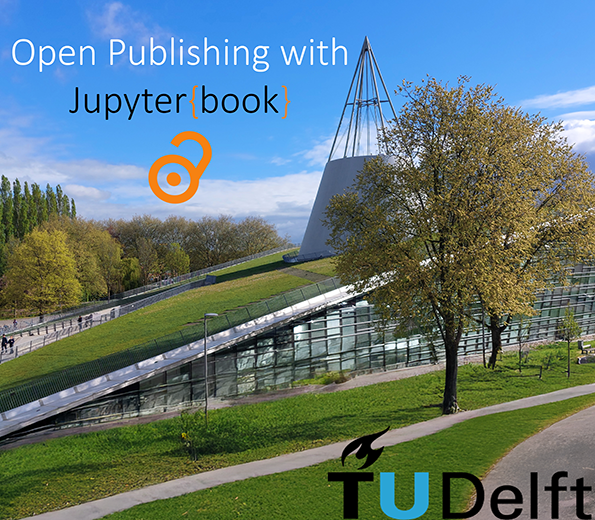

+++ { "kind": "split-image" }

## The TUD guide to open publishing with JupyterBook

a comprehensive resource for educators, researchers, and students

{button}`Check our latest book publication <https://tudelft.nl>`



+++

The TU Delft guide to open publishing with JupyterBook is a comprehensive resource for educators, researchers, and students interested in using the JupyterBook for creating and sharing scientific and educational content. This guide provides step-by-step instructions, best practices, and practical examples to help users with the process of building and publishing their own JupyterBooks. We focus especially on the production of bachelor and master thesis, as well as open education resources.


+++ {"kind": "justified"}
## Get started

````{grid} 2
```{card}
:header: Manual
:link: content/1_general/1_intro.md

📖 Read the manual
```

```{card}
:header: Starterkit
:link: no-link

✍ Use the starterkit
```


```{card}
:header: Typst thesis template
:link: no-link

📈 See the Typst thesis template
```

```{card}
:header: LaTeX thesis template
:link: no-link

📑 Inspect the LaTeX thesis template
```

````

+++